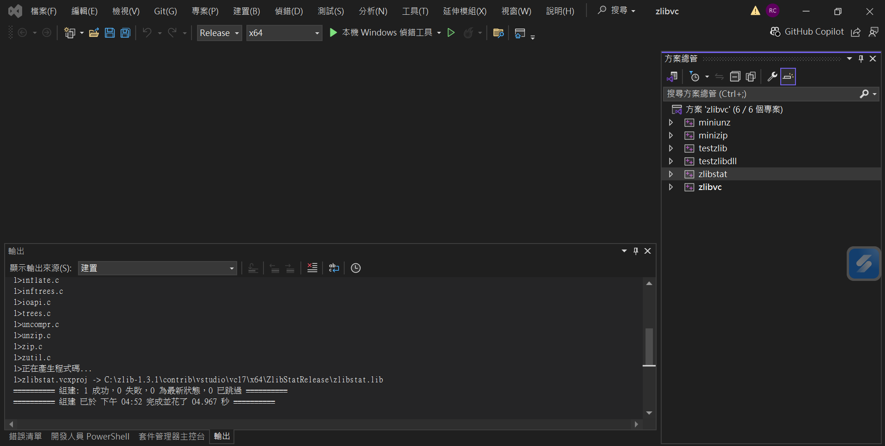

## How to Build (Windows)
```bash
mkdir build
cd build
rm ./CMakeCache.txt
cmake ..
cmake --build .
cmake --build . -j 4
```
* How to download CMake: https://hackmd.io/@YjqyYeVWSh27d4c92Ha5aw/r1LYBtiqL
* How to use json: https://github.com/nlohmann/json
    * Download json.hpp
    * Add include path to `c_cpp_properties.json`
    * Add `target_include_directories()` to `CMakeLists.txt`

## How to use CNPY
* Pre-request: ZLIB
    * https://zlib.net/

* Git clone and CMake
```bash
git clone https://github.com/rogersce/cnpy.git
cd cnpy
cp -r ../zlib_deps/ .
# revise CMakeLists.txt before install
mkdir build
cd build
rm CMakeCache.txt
cmake ..
cmake --install . --prefix ../install
```
* Revise CMakeLists.txt
    * Revise `CMAKE_MINIMUM_REQUIRED`: `CMAKE_MINIMUM_REQUIRED(VERSION 3.10 FATAL_ERROR)`
    * Add `ZLIB_LIBRARY` and `ZLIB_INCLUDE_DIR`
```bash
set(ZLIB_LIBRARY "C:/Users/user/Desktop/imaging_alg_dev/csa-sar-imaging/cnpy/zlib_deps/zlib.lib")
set(ZLIB_INCLUDE_DIR "C:/Users/user/Desktop/imaging_alg_dev/csa-sar-imaging/zlib_deps/cnpy")
```

## How to Run Unit Test of ImagingPar
* How to run
```bash
cd TestImagingPar
python "C:\Users\user\Desktop\imaging_alg_dev\csa-sar-imaging\TestImagingPar\TestImagingPar.py"
```
* Expected result
```
--- C++ Program Output (STDOUT) ---
Successfully parsed JSON from input_par.json
Successfully saved JSON to output_par.json
test_echo_sig
run gen echo sig.
size: (11110, 5120)

error of range_time_axis_sec: 1.3206826705950846e-16
error of range_freq_axis_hz: 0.0
error of azimuth_time_axis_sec: 0.0
error of azimuth_freq_axis_hz: 2.2724534198825808e-09
error of point_target_echo_signal: 6.589860984223574e-11
```

## How to Run Unit Test of ChirpScalingAlgo
* How to run
```bash
cd TestChirpScalingAlgo
python "C:\Users\user\Desktop\imaging_alg_dev\csa-sar-imaging\TestChirpScalingAlgo\TestChirpScalingAlgo.py"
```
* Expected result
```
--- C++ Program Output (STDOUT) ---
Successfully parsed JSON from input_par.json
DONE

error of migr_par: 0.0
error of modified_range_fm_rate_hz_s: 0.85546875
error of chirp_scaling: 7.60147962318357e-06
error of range_comp_filt: 5.649693117527584e-07
error of second_comp_filt: 1.5187342971948313e-06
error of azimuth_comp_filt: 0.0005693734640466298
error of third_comp_filt: 2.884547592603172e-05
error of azimuth_fft_out: 2.6505967318962585e-07
error of chirp_scaling_out: 3.9928098193336707e-07
error of azimuth_fft_out: 2.6505967318962585e-07
error of azimuth_fft_out: 2.6505967318962585e-07
error of chirp_scaling_out: 3.9928098193336707e-07
error of azimuth_fft_out: 2.6505967318962585e-07
error of azimuth_fft_out: 2.6505967318962585e-07
error of azimuth_fft_out: 2.6505967318962585e-07
error of azimuth_fft_out: 2.6505967318962585e-07
error of azimuth_fft_out: 2.6505967318962585e-07
error of chirp_scaling_out: 3.9928098193336707e-07
error of azimuth_fft_out: 2.6505967318962585e-07
error of chirp_scaling_out: 3.9928098193336707e-07
error of chirp_scaling_out: 3.9928098193336707e-07
error of range_fft_out: 8.83434486876829e-05
error of range_fft_out: 8.83434486876829e-05
error of second_phase_func_out: 0.0005975093774329202
error of range_ifft_out: 1.2523505521826202e-05
error of third_phase_func_out: 0.0007553784833669586
error of csa_out: 1.1978915985926695e-05
error of inverse_csa_out: 1.3658552034473888e-08
```

```bash
python "C:\Users\user\Desktop\imaging_alg_dev\csa-sar-imaging\TestIterRecovAlgo\TestIterRecovAlgo.py"
python ./TestIterRecovAlgo.py
```