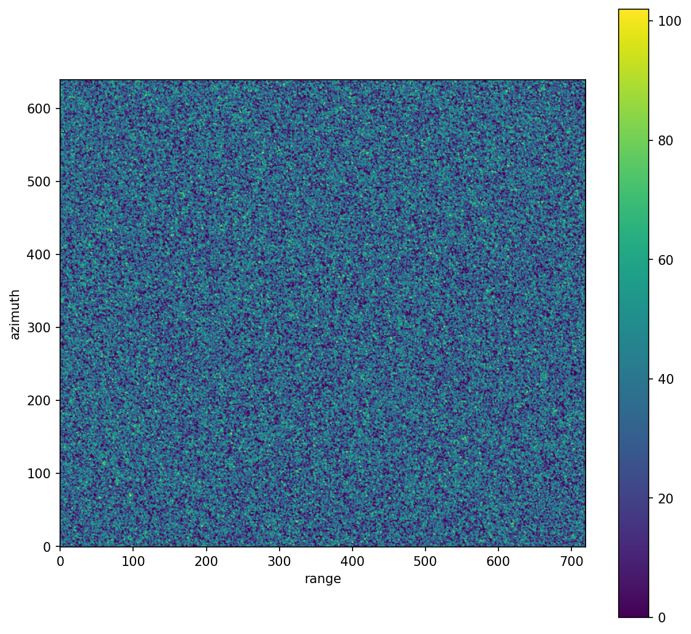
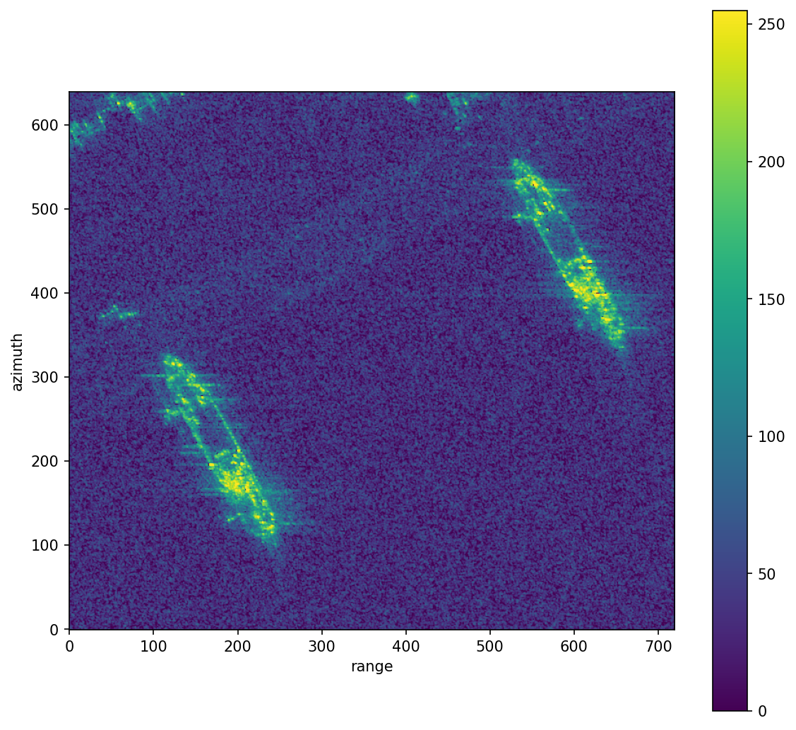

# tsoying_naval_base — Scene Comparison

File: `2023-04-12-13-00-32_UMBRA-04_GEC.tif`

## Background

### Gamma Distribution for SAR Intensity

Under the standard SAR speckle model, the complex return of each resolution cell is the
coherent sum of many independent scatterers. For a detected (amplitude) image, the
**intensity** $I = a^2$ (amplitude squared) follows a Gamma distribution:

$$I \sim \text{Gamma}(k,\, \theta)$$

with PDF:

$$f(I;\,k,\theta) = \frac{I^{k-1}\,e^{-I/\theta}}{\theta^k\,\Gamma(k)}, \quad I > 0$$

The shape parameter $k$ equals the **number of looks** $L$, and $\theta = \sigma^2 / L$
where $\sigma^2$ is the mean backscatter power.  Moments of the fit are:

$$\text{Mean} = k\theta, \qquad \text{Variance} = k\theta^2$$

Parameters are estimated by **Maximum Likelihood (MLE)**, maximising:

$$\ell(k,\theta) = \sum_{i=1}^{n}\left[(k-1)\ln I_i - \frac{I_i}{\theta} - k\ln\theta - \ln\Gamma(k)\right]$$

with the location fixed at zero (`floc=0`) because intensity cannot be negative.

### KS Statistic

The Kolmogorov–Smirnov statistic measures the largest vertical gap between the empirical CDF $F_n$
and the theoretical CDF $F$:

$$D_n = \sup_x \left| F_n(x) - F(x) \right|$$

where $F_n(x) = \frac{1}{n}|\{i : I_i \le x\}|$.  $D_n \in [0, 1]$;
smaller is a better fit.  The p-value is omitted here: with large SAR images
($n > 10^5$), even a trivially small $D_n$ yields $p < 0.05$, making the
p-value an unreliable indicator at this scale.  Use $D_n$ directly.

### KL Divergence

The Kullback–Leibler divergence measures how much the empirical distribution $P$
differs from the fitted theoretical distribution $Q$:

$$D_{\mathrm{KL}}(P \| Q) = \sum_{i} p_i \ln \frac{p_i}{q_i}$$

where $p_i$ and $q_i$ are the empirical and Gamma probabilities in each histogram bin
(200 bins over the 0–99.5th percentile range, both normalised to sum to 1).
Units are **nats** (natural units of information: the result of using $\ln$ instead of $\log_2$;
1 nat $= \log_2 e \approx 1.4427$ bits). $D_{\mathrm{KL}} = 0$ means perfect agreement;
values below 0.05 nats indicate a good fit.

KL is complementary to KS: KS detects the single worst-case gap anywhere in the
distribution, while KL accumulates evidence of mismatch across all bins,
penalising heavy-tailed deviations more strongly.

## Scenes

| **scene-A** | **scene-B** |
|---|---|
| Open sea area — no ship objects present | Harbor area — ship objects present |
| row\_start=4500, row\_len=640, col\_start=4500, col\_len=720 | row\_start=4050, row\_len=640, col\_start=4180, col\_len=720 |
|  |  |

## Gamma Fit Comparison

| Metric | scene-A | scene-B | Reasonable |
|---|---|---|---|
| shape k | 1.1073 | 0.7467 | ~1 (single-look) to ~4 (multi-look) |
| scale θ | 1305.6268 | 3808.1505 | scene-dependent |
| sample mean / fit mean = ratio | 1445.75 / 1445.75 = 1.0000 | 2843.68 / 2843.68 = 1.0000 | ratio ≈ 1.0000 |
| sample var / fit var = ratio | 1377312.98 / 1887615.75 = 1.3705 | 30854874.81 / 10829178.19 = 0.3510 | ratio ≈ 1.0000 |
| KS statistics | 0.0610 | 0.1168 | < 0.05 excellent, < 0.10 good |
| KL divergence (nats) | 0.8528 | 0.1416 | < 0.05 good, < 0.01 excellent |
