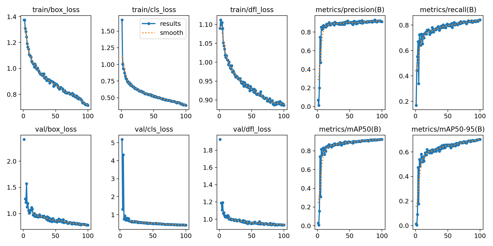
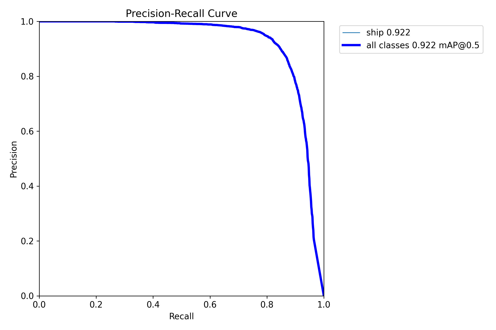
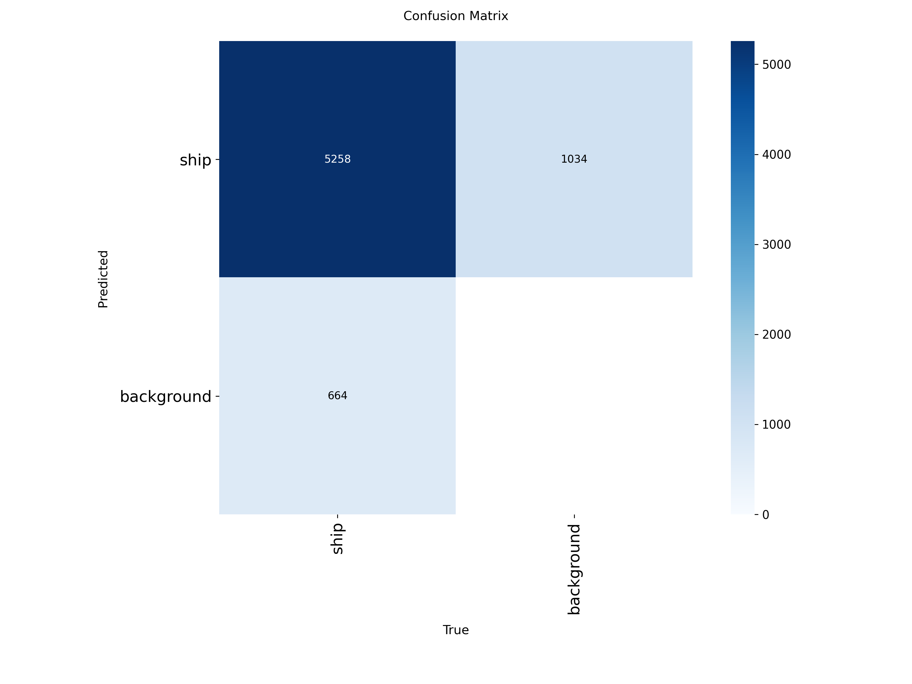

# Training results — YOLO11m on HRSID

A YOLO11m detector trained on the HRSID ship-detection dataset (single class `ship`).

## Configuration
| | |
|---|---|
| Model | `yolo11m.pt` (pretrained, fine-tuned) |
| Dataset | HRSID — `HRSID_YOLO/data.yaml` (3,642 train / 1,962 val images) |
| Image size | 800 × 800 |
| Batch | 32 |
| Epochs | 100 |
| Optimizer | auto (SGD), `lr0=0.01` |
| Hardware | 1× NVIDIA RTX 5090 (32 GB) |
| Wall-clock | **0.97 h** (~35 s/epoch) |

Reproduce:
```bash
yolo detect train model=yolo11m.pt data=HRSID_YOLO/data.yaml \
    imgsz=800 epochs=100 batch=32 device=0 project=runs name=hrsid_yolo11m
```

## Final results
Validation on the HRSID test split (1,962 images, 5,922 ship instances), `best.pt`:

| Metric | Value |
|---|---|
| **mAP@0.5** | **0.922** |
| **mAP@0.5:0.95** | **0.702** |
| Precision | 0.910 |
| Recall | 0.840 |
| Inference speed | 2.0 ms/image (~500 img/s) on RTX 5090 |

Best epoch: 100 (full schedule, no early stopping — metrics still trending up at the end).

## Training progress
| Epoch | mAP@0.5 | mAP@0.5:0.95 |
|---|---|---|
| 1 | 0.029 | 0.014 |
| 6 | 0.818 | 0.539 |
| 16 | 0.854 | 0.595 |
| 26 | 0.875 | 0.618 |
| 41 | 0.890 | 0.652 |
| 56 | 0.902 | 0.662 |
| 71 | 0.907 | 0.674 |
| 86 | 0.919 | 0.692 |
| 100 | 0.922 | 0.702 |

mAP@0.5 climbed sharply in the first ~6 epochs, then refined steadily; mAP@0.5:0.95
(localization quality) kept improving through the final epochs.

## Plots


| Precision–Recall curve | Confusion matrix |
|---|---|
|  |  |

## Notes
- Trained weights (`runs/hrsid_yolo11m/weights/best.pt`) are **not committed** (gitignored).
  Re-run the command above to regenerate, or copy `best.pt` out-of-band.
- HRSID is Sentinel-1/TerraSAR-X. Expect a domain-shift drop if evaluating this model
  on a different sensor (e.g. Umbra/Capella).
