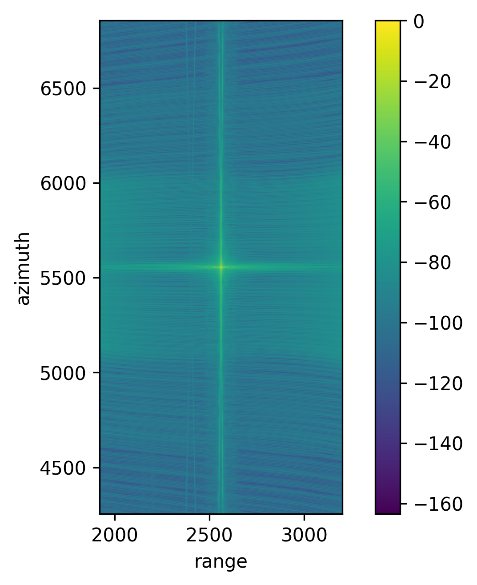
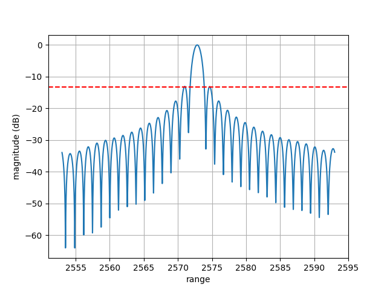
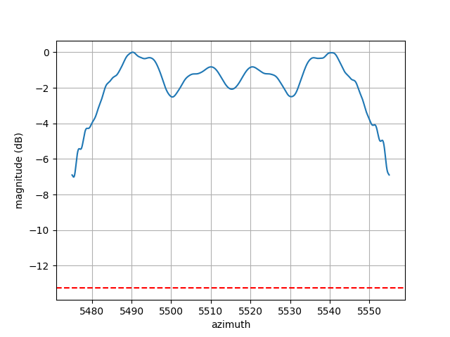
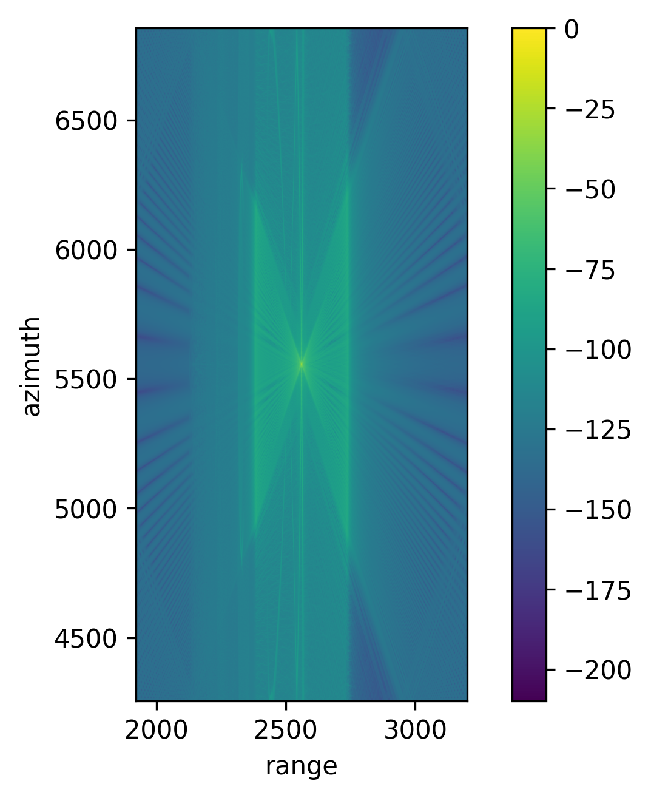
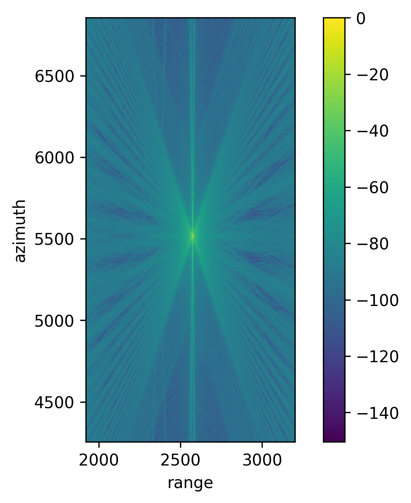
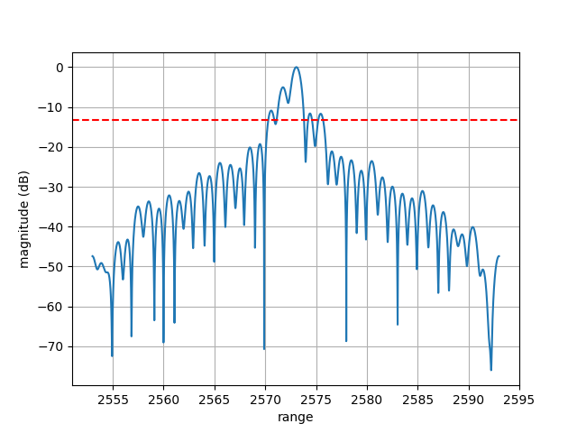
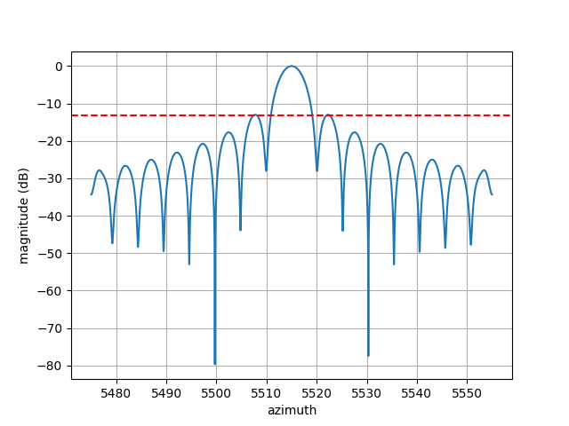
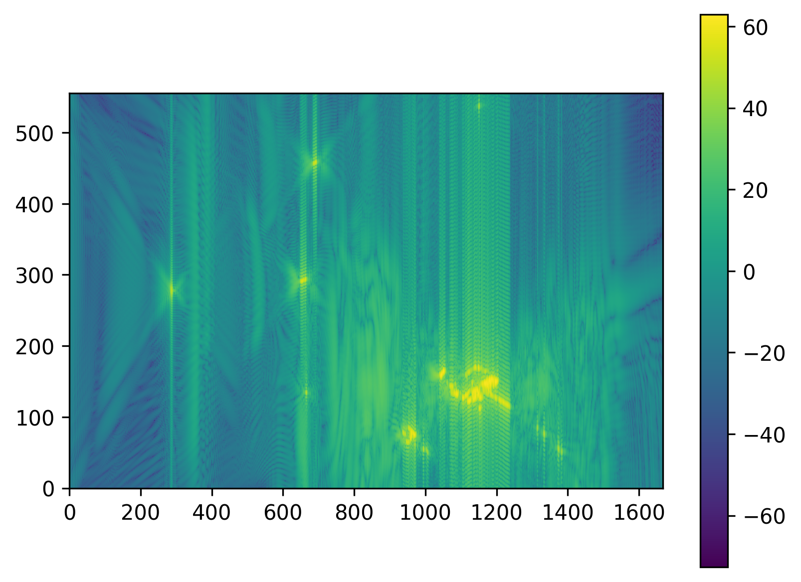
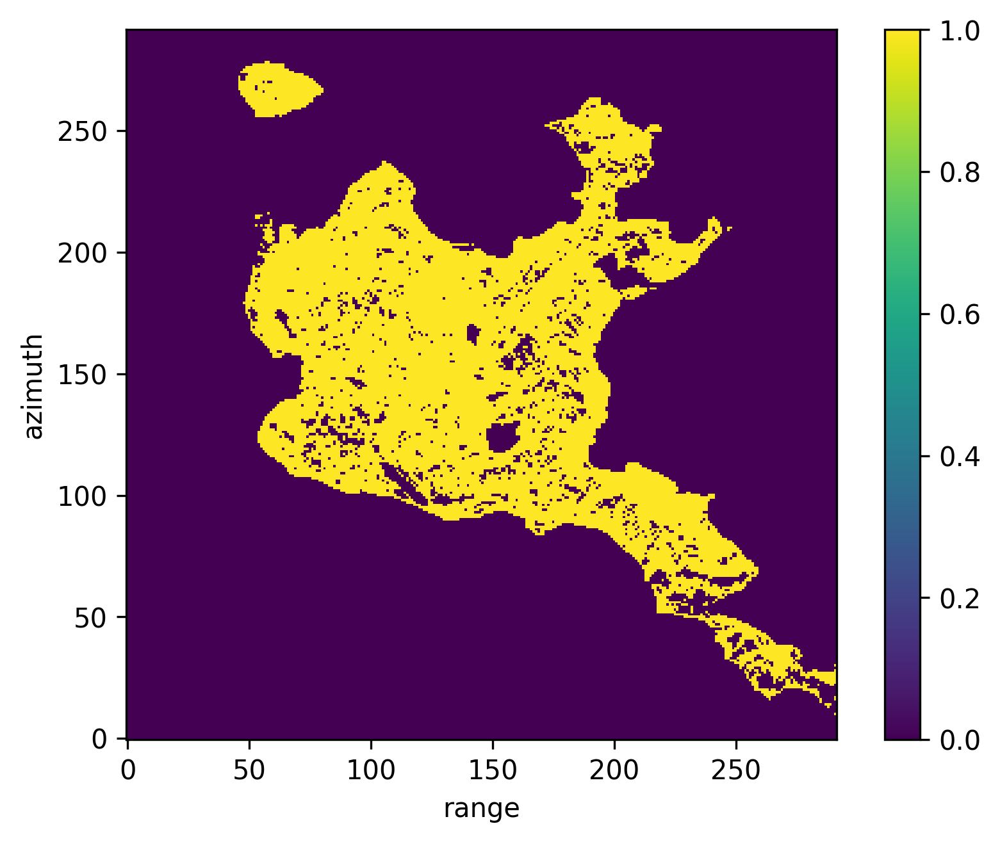
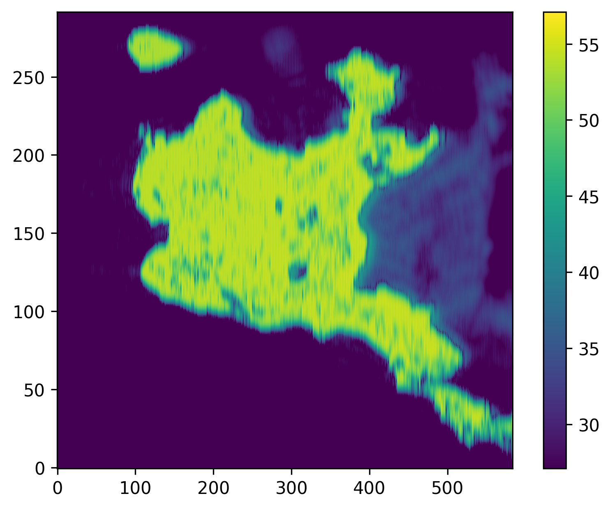

## Azimuth Compression With Variant Range
* azimuth compression filter with fixed range
    * location $T_3$: azimuth time offset is 0.04 sec, range distance offset is 30 m

|point target at scene center $T_0$|point target at location $T_3$|
|:---:|:---:|
|||
|||
|||

* azimuth compression filter with variant range
    * location $T_3$: azimuth time offset is 0.04 sec, range distance offset is 30 m

|point target at scene center $T_0$|point target at $T_3$|
|:---:|:---:|
|||
|||
|||

## Scaling
|full scale|30 dB dynamic range|ground truth|
|:---:|:---:|:---:|
||||

## Effect of Thresholding Operator

|binary|CSA|thresholding|
|:---:|:---:|:---:|
||||