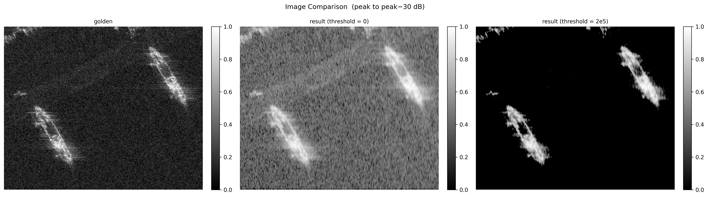

# Performance Metrics

*Last updated: 2026-04-11 00:01:20*

> All metrics are computed after converting both images to dB scale
> and applying **peak-to-peak−30 dB** normalisation to [0, 1].

---

## Metric Definitions

### SSIM — Structural Similarity Index

SSIM measures perceived image similarity by independently comparing local
luminance, contrast, and structure within sliding Gaussian-weighted windows
(σ = 1.5, equivalent to an 11×11 kernel). The final score is the mean over
all window positions. Range: [−1, 1]; **higher is better**.

$$\text{SSIM} = L \cdot C \cdot S$$

### L — Luminance

$$L(x,y) = \frac{2\mu_x\mu_y + C_1}{\mu_x^2 + \mu_y^2 + C_1}$$

Compares the local **mean brightness** μ of each patch.
L ≈ 1 when both patches have the same average intensity.
C₁ = (0.01 · data\_range)² stabilises the ratio near zero.

### C — Contrast

$$C(x,y) = \frac{2\sigma_x\sigma_y + C_2}{\sigma_x^2 + \sigma_y^2 + C_2}$$

Compares the local **standard deviation** σ (texture energy / variation).
C ≈ 1 when both patches have the same spread.
A flat patch (σ ≈ 0) against a textured one drives C toward 0.
C₂ = (0.03 · data\_range)².

### S — Structure

$$S(x,y) = \frac{\sigma_{xy} + C_3}{\sigma_x\sigma_y + C_3}$$

The normalised cross-covariance — equivalent to the **Pearson correlation**
between patch values. Measures whether spatial patterns match regardless of
brightness or contrast. S = 1 for identical shapes, S = −1 for inverted.
C₃ = C₂ / 2.

### PSNR — Peak Signal-to-Noise Ratio

$$\text{PSNR} = 20\log_{10}\left(\frac{1}{\sqrt{\text{MSE}}}\right) \text{ dB}$$

Measures pixel-level fidelity on the normalised images. **Higher is better.**

### MSE — Mean Squared Error

$$\text{MSE} = \frac{1}{N}\sum_{i}(x_i - y_i)^2$$

Computed on the peak−30 dB normalised [0, 1] images. **Lower is better.**

### SCR — Signal-to-Clutter Ratio

$$\text{SCR} = 10\log_{10}\left(\frac{\bar{P}_{\text{signal}}}{\bar{P}_{\text{clutter}}}\right) \text{ dB}$$

Computed independently on each image (golden in linear amplitude, result in dB).
The brightest pixel is taken as the target centre. An inner disk of radius
r₁ = 5 px defines the **signal zone**; an annulus between r₁ and r₂ = 15 px
defines the **clutter zone**. Mean power is compared between the two regions.
**Higher is better** — a larger SCR means the target stands out more clearly
above the background clutter.

---

## Results

| Metric | result (threshold = 0) | result (threshold = 2e5) |
|--------|-------- | --------|
| SSIM | 0.33491 | 0.03021 |
| Luminance (L) | 0.89509 | 0.06166 |
| Contrast (C) | 0.69948 | 0.15396 |
| Structure (S) | 0.49793 | 0.94501 |
| PSNR (dB) | 10.81 | 3.40 |
| MSE \[0,1\] | 0.08305 | 0.45706 |
| SCR result (dB) | 0.78 | 1.04 |

---

## SSIM Component Interpretation

| Metric | SAR Interpretation | Role in Object Detection |
|:---:|:---:|:---:|
| Luminosity (L) | Average Backscatter | Distinguishes overall "brightness"; secondary to shape. |
| Contrast (C) | Variance/Intensity | Essential for separating target signal from background clutter. |
| Structure (S) | Spatial Correlation | Primary metric. Defines the shape and prevents false alarms from noise. |

---

## Image Comparison

