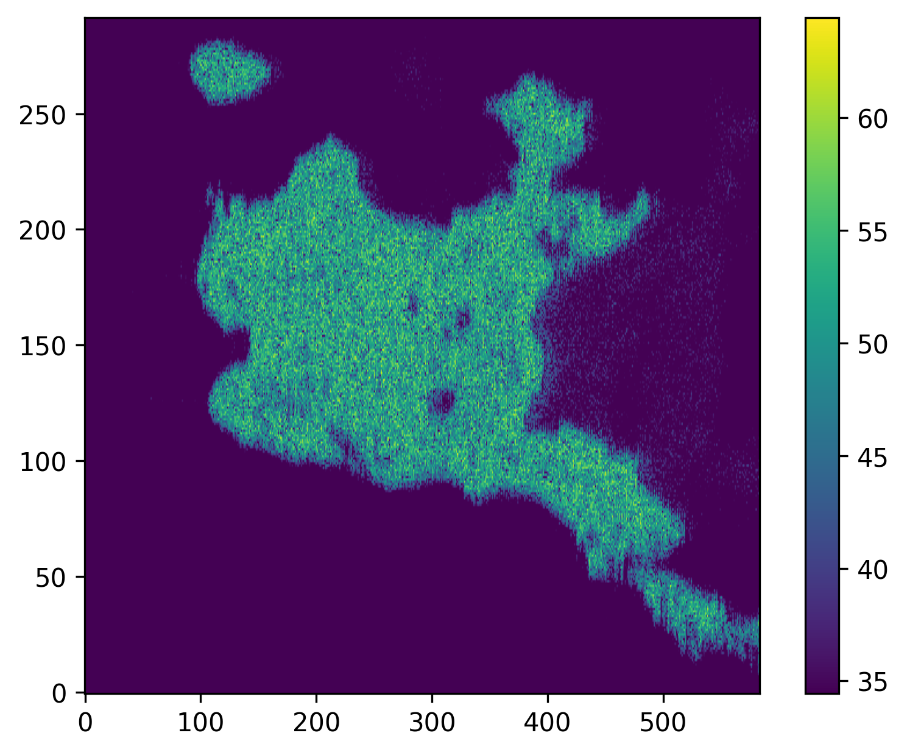
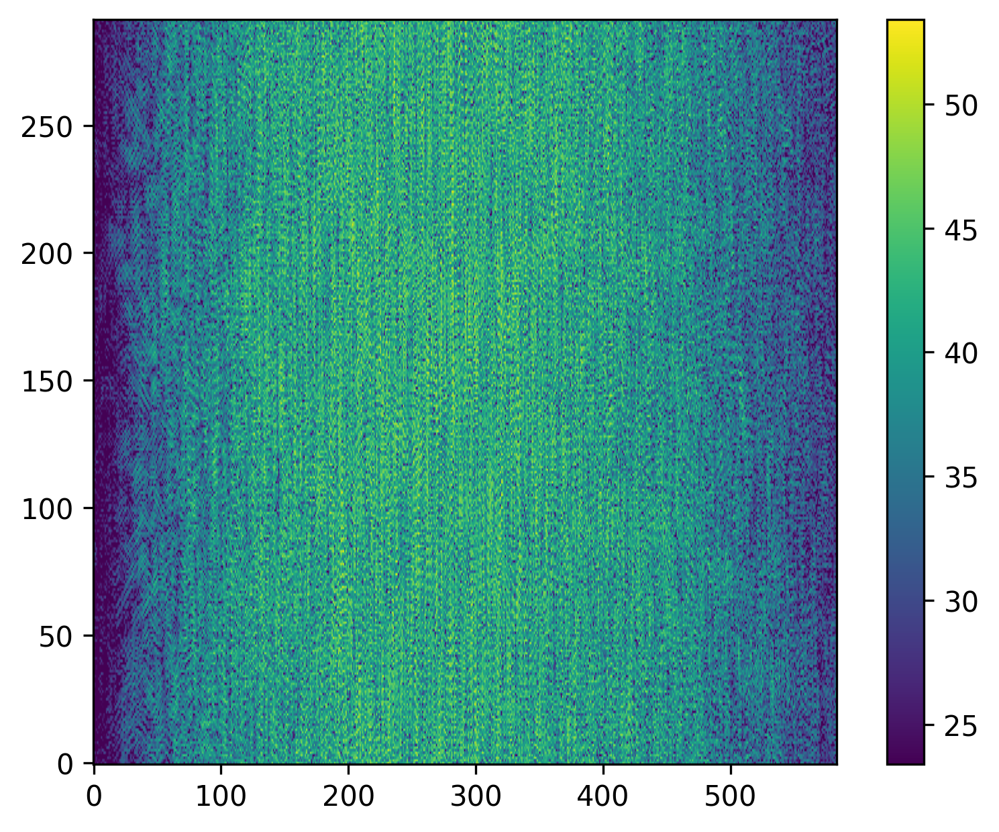
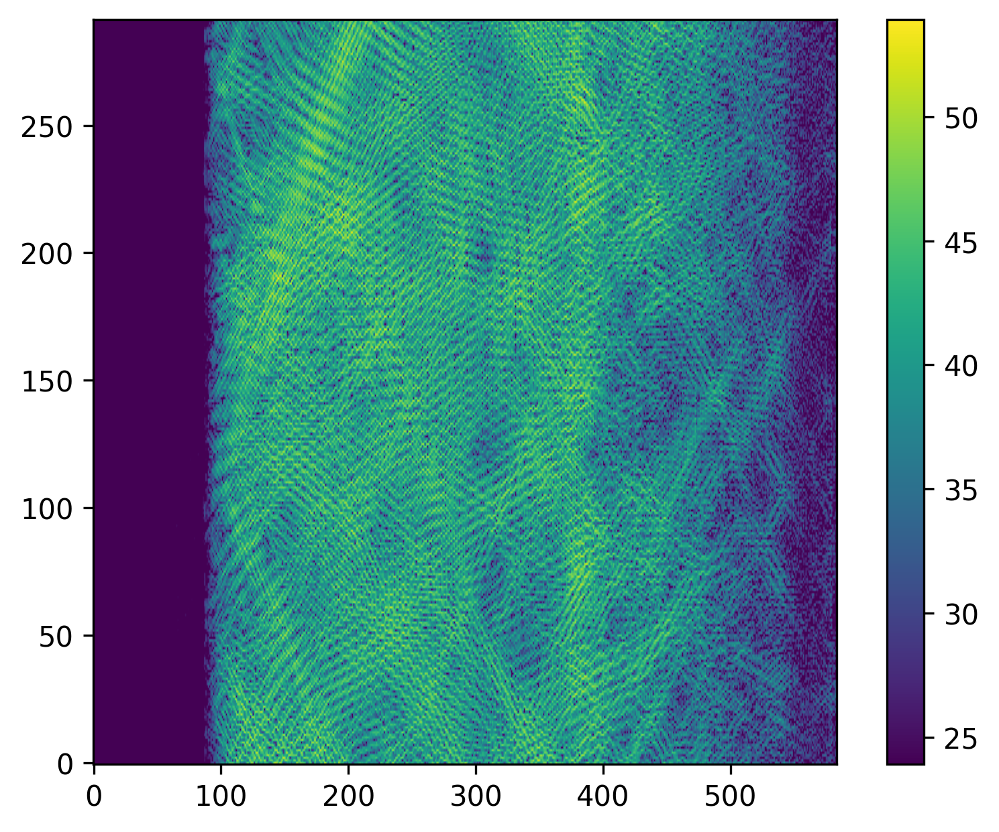

## Signal Model
* Multi-target scattering model of chirp signal: $S=[s_{m,n}]_{M\times N}$
    * $\eta=m\Delta\eta$: Slow time
    * $\tau=m\Delta\tau$: Fast time
    * $A_k$: Scattering coefficient of point target $k$
    * $R_k(m\Delta\eta)=\sqrt{(R_0+\Delta R_{0,k})^2+(m\Delta\eta+\Delta\eta_k)^2V_r^2}$
        * $\Delta R_{0,k}$: Slant range offset from point target $k$ to scene center
        * $\Delta\eta_k$: Azimuth time offset from point target $k$ to scene center

$$s_{m,n}=\sum_k A_{k}
\text{rect}\left(\frac{n\Delta\tau-\frac{2R_k(m\Delta\eta)}{2}}{T_r}\right)
\cdot e^{j\pi\cdot\frac{B_r}{T_r}\cdot\left(n\Delta\tau-\frac{2R_k(m\Delta\eta)}{2}\right)^2}
\cdot e^{-j4\pi\frac{R_k(m\Delta\eta)}{\lambda}}$$

* Coherent scattering in time domain: $S\circ C+W$
    * Time domain: $C=[c_{m,n}]_{M\times N}, c_{m,n}=e^{j\theta_{m,n}}, \theta_{m,n} \sim U(0,2\pi)$
* Coherent scattering in spatial domain: $T(S+W)\circ C$
    * $C=[c_{m,n}]_{M\times N}, c_{m,n} \sim E(1)$
    * $T(\cdot)$: Imaging algorithm, e.g. RDA or CSA
* Thermal noise (time domain): $W=[w_{m,n}]_{M\times N}, w_{m,n} \sim CN(0, \sigma)$
    * $\sigma^2=P_n/2$
    * $P_n=P_s/SNR$: Instantaneous noise power
    * $P_s=\Re\{x[n]\}^2+\Im\{x[n]\}^2$: Instantaneous signal power

## How to Convert Image to Echo Signal

## Simulation Parameter
|parameter|description|
|:---:|:---:|
|`wavelength_m`||
|`pulse_width_sec`||
|`pulse_rep_freq_hz`||
|`bandwidth_hz`||
|`sampling_freq_hz`||
|`closest_slant_range_m`||
|`azi_win_en`|enable of azimuth window (beam pattern)|
|`rng_pad_time`|range padding time, length in row direction of echo signal will be `pulse_width_sec`$\times$`sampling_freq_hz`$\times$`rng_pad_time`|
|`noise_en`|enable of additive noise|
|`snr_db`|SNR in dB (which will be ignored if `noise_en` is `False`)|

## Simulation Result of Speckle Effect
|spatial domain|time domain|time domain (only varies in slow time)|
|:---:|:---:|:---:|
||||

